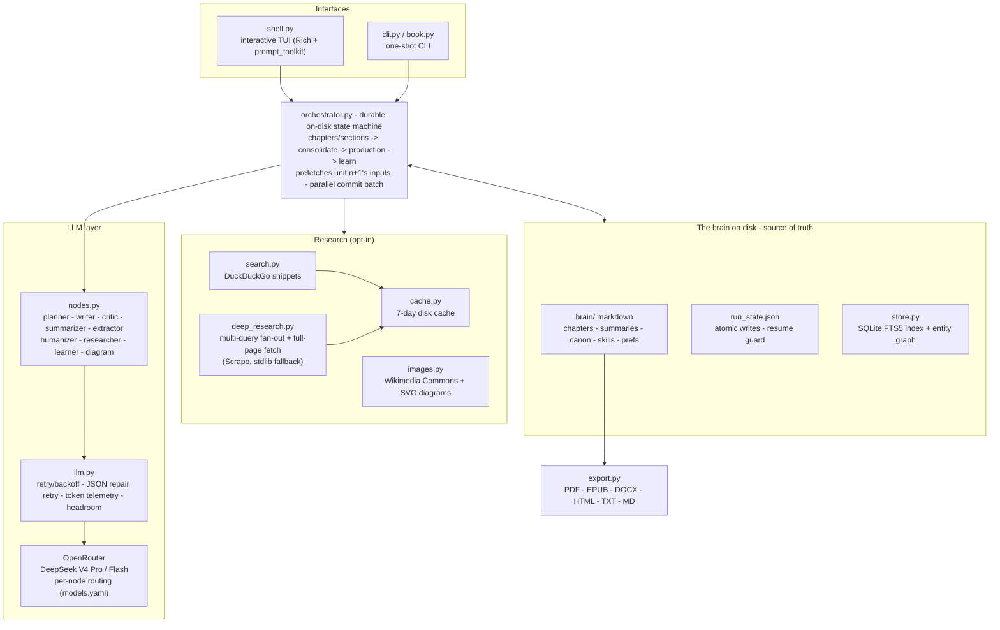

<div align="center">


### an autonomous writing studio - books, articles & more

[](https://github.com/vikast908/WritingAgent/actions/workflows/ci.yml)
[](https://www.python.org/)
[](#setup)
[](https://openrouter.ai/)
[](https://deepseek.com/)
[](https://github.com/chopratejas/headroom)
[](LICENSE)

**self-correcting pipeline · books + articles · 6 export formats · 10 TUI themes · cost guardrails + telemetry · resilient (retry + resumable) · local-first**

[Setup](#setup) · [Quick Start](#quick-start) · [The TUI](#the-tui) · [How It Works](#how-it-works) · [Commands](#commands) · [Export](#export-formats) · [Features](#features) · [Themes](#themes) · [Architecture](#architecture)

</div>

---

## What it does

Writing Agent is a self-correcting, autonomous writing system that takes a topic and produces a publication-ready manuscript - drafting, critiquing, humanising, and revising in a loop until the work meets quality standards.

- **Books** - multi-chapter narratives with memory, continuity audits, and front/back matter
- **Articles** - long-form editorial pieces with research, citations, and editorial angles
- **One-shot `write`** - interviews you once upfront, then researches, writes, self-edits, and exports the finished file with zero mid-run interruptions
- **Self-correction** - write → critique → revise → humanise → commit, up to a cap, then escalate
- **Quality guardrails** - hard rules against AI slop baked into every prompt
- **Context compression** - [headroom-ai](https://github.com/chopratejas/headroom) runs by default; 60–95% fewer tokens, same output quality

---

## Setup

**Requirements:** Python 3.10+ · runs on **Linux · macOS · Windows** · an [OpenRouter API key](https://openrouter.ai/) (free tier works). No API key is needed to install, run the tests, or try the offline demo.

### 1 - Clone

```bash
git clone https://github.com/vikast908/WritingAgent.git
cd WritingAgent
```

### 2 - Create & activate a virtualenv

<table>
<tr><th>Linux / macOS</th><th>Windows (PowerShell)</th></tr>
<tr><td>

```bash
python3 -m venv .venv
source .venv/bin/activate
```

</td><td>

```powershell
python -m venv .venv
.venv\Scripts\Activate.ps1
```

</td></tr>
</table>

> **Windows note:** if PowerShell blocks the activate script, run once:
> `Set-ExecutionPolicy -Scope Process -ExecutionPolicy Bypass`, then re-activate.

### 3 - Install

```bash
pip install -e .                 # core (all platforms)
pip install -e ".[dev]"          # + pytest + ruff (for development)
```

### 4 - (optional) context compression via headroom

Headroom is optional - the app runs fine without it and degrades gracefully.

| Platform | Command |
|---|---|
| **Linux / macOS** | `pip install -e ".[headroom]"` - prebuilt Rust wheels, installs cleanly |
| **Windows** | `pip install -e ".[headroom]"` then `pip install --only-binary=:all: --no-deps "headroom-ai==0.10.17"` - current versions have no Windows wheel, so we use the last pure-Python release (skips the `litellm` dep, whose long paths break installs without long-path support) |

### 5 - Add your API key

<table>
<tr><th>Linux / macOS</th><th>Windows (PowerShell)</th></tr>
<tr><td>

```bash
cp .env.example .env
```

</td><td>

```powershell
copy .env.example .env
```

</td></tr>
</table>

Then edit `.env` and set `OPENROUTER_API_KEY=sk-or-...`.

---

## Quick Start

Launch the interactive TUI (works the same on every OS once the venv is active):

```bash
writing-agent          # or:  python book.py
```

The fastest path is **`write`** - it interviews you once upfront (audience, depth, length,
tone, must-includes), then runs fully autonomously and hands you a finished, exported file:

```
❧ deepseek-v4-flash ›  write --abstract "How stoicism applies to modern burnout"
```

Or drive each step yourself from the `❧` prompt:

```
❧ deepseek-v4-flash ›  new --abstract "How stoicism applies to modern burnout"
❧ deepseek-v4-flash ›  run
❧ deepseek-v4-flash ›  export
❧ deepseek-v4-flash ›  read --manuscript
```

Or one-shot from the terminal:

```bash
python book.py write --abstract "The psychology of decision fatigue"
# or step by step:
python book.py new --abstract "The psychology of decision fatigue" --pick 1
python book.py run
python book.py export --format pdf
```

The TUI shows a **live dashboard** while writing, tab-autocompletes everything, and remembers history - the full tour is in [The TUI](#the-tui) below.

### Try it offline first - no API key (fake mode)

Every node returns deterministic placeholder output, so you can verify the full pipeline, state machine, and exports without a key or any token spend.

<table>
<tr><th>Linux / macOS</th><th>Windows (PowerShell)</th></tr>
<tr><td>

```bash
export BOOK_AGENT_FAKE=1
python book.py new --abstract "test" --pick 1
python book.py run
python book.py export --format pdf
unset BOOK_AGENT_FAKE
```

</td><td>

```powershell
$env:BOOK_AGENT_FAKE = "1"
python book.py new --abstract "test" --pick 1
python book.py run
python book.py export --format pdf
$env:BOOK_AGENT_FAKE = $null
```

</td></tr>
</table>

---

## The TUI

The shell is a full editorial workspace, not a bare prompt:

- **Masthead & themes** - a gradient-filled ANSI Shadow wordmark framed by gradient rules,
  left-aligned. Ten built-in themes (`/theme`) change *everything*: palette, the wordmark's
  figlet face, glyphs, and text tint - from the blue-ink `editorial` default to `kazama`
  (Tekken flame), `fallout` (Pip-Boy CRT), `vercel` (monochrome), and more. [Full list ↓](#themes)
- **Welcome screen** - compact by design so the wordmark is still on screen at the first
  prompt: how to start, your projects with live phase/progress, and a one-line feature
  status. The full command list is `/help`; the feature board is `/features`.
- **`write` interview flow** - one batch of tailored questions upfront (each with a default you
  accept by pressing Enter), then it runs to a finished exported file with zero interruptions.
- **Live run dashboard** - progress bar, current chapter/section and stage, elapsed time, live
  token count vs your `max_run_tokens` budget, and real USD cost as it accrues.
- **`/dashboard` telemetry view** - totals (calls · tokens · $ · avg latency · errors), a
  per-model table, and recent runs; `/dashboard <project>` breaks it down per chapter/section.
- **Autocomplete everywhere** - commands, slash commands, project names, settings keys/values,
  theme names, export formats; persistent history across sessions (↑ to recall).
- **Free chat** - type plain English and the built-in assistant answers or converts it into
  commands and runs them (destructive commands are never auto-executed).
- **Graceful degradation** - `--plain` / `NO_COLOR` for unstyled output; UTF-8 forced on
  legacy Windows consoles; falls back cleanly when Rich or prompt_toolkit are unavailable.

---

## How It Works

### Article mode

```
topic
  └─▶ 3 editorial angles  (you pick, or --pick N)
        └─▶ outline  (4–8 sections)
              └─▶ per section ──────────────────────────────────────────────┐
                    web research  →  write  →  critique  →  revise (×N)    │
                    →  humanise  →  commit                                  │
              └─▶ assemble manuscript  →  learn skills  →  done ◀──────────┘
```

Output: `brain/users/<user>/articles/<id>/manuscript.md` + `images/`

### Book mode

```
abstract
  └─▶ 3 directions  (you pick, or --pick N)
        └─▶ plan + chapter blueprints  (TOC)
              └─▶ per chapter ─────────────────────────────────────────────┐
                    context slice + skills  →  write  →  critique          │
                    →  revise (×N)  →  humanise  →  commit                 │
              └─▶ periodic consolidation  (contradiction audit)            │
              └─▶ production  (front/back matter, assembly)                │
              └─▶ learn skills  →  done ◀──────────────────────────────────┘
```

Output: `brain/users/<user>/books/<id>/manuscript.md` + front/back matter

### Self-correction loop

Every drafted section/chapter goes through:

```
Thesis (per article: a contestable claim, injected everywhere)
   │
N divergent drafts (varied temps)  →  Critic ranks  →  best is refined
   │                                   (or you pick, in manual mode)
Draft  →  Critic (approve | revise | escalate) + insight/clarity/structure/evidence scores
              │
         revise ──▶ up to max_revisions (default 2)
              │
         low insight ──▶ "sharpen the argument" pass
              │
         cap reached ──▶ escalate (TUI picker: fix / instruct / approve / go-auto / read)
              │
         approved ──▶ surgical Humanizer (only flagged sentences) ──▶ commit
              │
         (article done) ──▶ table read (skeptical reader) ──▶ eval scorecard
```

**Not-slop, by design.** The pipeline guarantees the *floor* (banned-word/continuity checks)
**and** pushes the *ceiling*: a per-article **thesis** the Critic enforces, **voice exemplars**
(`brain/users/<id>/voice/`, fed by `/praise`) matched on every draft, an **insight score** that
gates approval, **divergent drafts** selected for strength, and a **surgical humanizer** that
edits only the sentences with AI tells (never re-generating approved prose). `eval` scores the
finished piece against published work; `versions` + `revise` give you git-style history and
one-unit rewrites.

---

## Commands

### Modes

| Command | Effect |
|---|---|
| `/mode article` | Write a long-form article - sections, angles, citations |
| `/mode book` | Write a full book - chapters, canon, consolidation (default) |

### Core commands

| Command | What it does |
|---|---|
| `write --abstract "..."` | **One-shot:** upfront interview (audience, depth, length, tone, must-includes, byline, format) → fully autonomous run → exported finished file. No mid-run pauses. |
| `new --abstract "..."` | Start a project - picks angles/directions, builds outline/TOC. `--autonomous` / `--no-autonomous` override the `autonomous` setting |
| `run` | Drive the pipeline: draft → critique → humanise → commit. `--autonomous` / `--manual` flips run mode (and unblocks a stalled review) as it resumes |
| `status` | Show phase, section/chapter progress, pending escalations |
| `review --chapter N --instruction "..."` | Answer an escalation; `run` resumes from that point. (In the TUI a stalled run shows an interactive picker: fix / instruct / approve / go-autonomous / read.) |
| `revise --chapter N --instruction "..."` | Rewrite **one** committed section/chapter of a finished piece (e.g. "make section 3 more technical"); shows a diff to accept/reject, then patches the manuscript |
| `read [--chapter N] [--summary] [--manuscript] [--v K]` | Read any section, summary, full manuscript, or **draft version K** |
| `versions [--chapter N]` | List draft snapshots - every variant, revision, and committed final (git-for-writing) |
| `brief` | The goal panel: thesis / premise, audience, target length, your requirements |
| `tableread [--as "persona"]` | Skeptical-reader cold read of the finished piece - boredom, trust, gaps (optional persona) |
| `eval` | Quality scorecard: judged 5-dimension rubric + deterministic metrics → `eval_report.md` |
| `export [--format <fmt>]` | Export (interactive picker if format omitted) |
| `memory` | Inspect canon - characters, timeline, entity graph |
| `skills` | Browse learned craft skills and efficacy scores |
| `list` | All projects with type and phase |
| `delete [--yes]` | Permanently delete a project |
| `consolidate` · `produce` | Continuity audit · front/back matter on demand |

### Slash commands

| Slash | What it does |
|---|---|
| `/update [description]` | Describe your changes - AI reviews and advises on next steps |
| `/auto [on\|off]` | Autonomous (never pause) ↔ manual (review each unit) run mode |
| `/praise [N]` | Mark a committed chapter/section as great writing - saved as a voice exemplar + fed to the learner |
| `/mode [book\|article]` | Show or set writing mode |
| `/use <project>` | Set active project (no `--book-id` needed on follow-up commands) |
| `/books` · `/list` | List all projects with type and phase |
| `/model [agent] <slug>` | Switch any agent to any OpenRouter model slug |
| `/set <key> <value>` | Toggle any setting live (`use_researcher`, `humanize`, `autonomous` …) |
| `/theme [<name>]` | List or switch the TUI theme - changes the palette **and** the wordmark font ([see Themes](#themes)) |
| `/dashboard [<project>]` | Telemetry rollup: calls, tokens, cost, latency, errors - all projects, or one project with its per-chapter/section breakdown |
| `/skills` · `/skill <name>` · `/seed-skills` | Browse / view / install built-in craft skills |
| `/retry` · `/reset` · `/compact` | Retry last response · clear memory · compress history |
| `/help` · `/clear` · `/exit` | Full slash list · clear screen · quit |

---

## Export Formats

```bash
export --format pdf      # paginated A5 PDF  (via xhtml2pdf)
export --format epub     # EPUB with NCX/Nav TOC  (via ebooklib)
export --format docx     # Word document  (via pandoc - must be on PATH)
export --format html     # self-contained HTML with embedded CSS
export --format txt      # clean plain text (Markdown stripped)
export --format md       # raw Markdown with title header
```

Just type `export` for an interactive picker.

---

## Features

| Feature | Setting | Default |
|---|---|:---:|
| Web research per section (DuckDuckGo) | `use_researcher` | ✅ on |
| Deep research - multi-query fan-out + full-page fetch + cross-source synthesis | `deep_research` | off |
| └ richer fetch backend ([Scrapo](https://github.com/vikast908/Scrapo); falls back to stdlib) | `pip install '.[deep]'` | optional |
| Humanizer - strips AI tells | `humanize` | ✅ on |
| Headroom context compression | `use_headroom` | ✅ on |
| SVG diagram generation (per section) | `use_images` | ✅ on |
| Semantic skill retrieval (embeddings) | `use_embeddings` | off |
| Fully autonomous (no pauses) | `autonomous` | off |
| TUI color + font theme ([see Themes](#themes)) | `theme` | editorial |
| Run token budget - pause the run past this spend (0 = unlimited) | `max_run_tokens` | 0 |
| Per-request network timeout (seconds) | `request_timeout` | 60 |

Toggle any feature live in the TUI: `/set use_researcher false`

---

## Themes

The TUI ships **10 themes**. A theme changes *everything*: the color palette, the wordmark's
figlet face, the banner gradient, the section glyph, and the body-text tint. Switch live with
`/theme <name>` (persisted to `settings.yaml`); bare `/theme` lists them with swatches.

| Theme | Identity | Wordmark face |
|---|---|---|
| `editorial` *(default)* | ink & brass - blue-ink accent, semantic status colors (green ok / red error) | ANSI Shadow |
| `kazama` | Jin Kazama - red → orange → yellow flame, Tekken italic lean | ANSI Shadow (sheared) |
| `supabase` | emerald on midnight - flat dashboard green | ANSI Regular |
| `violet-bloom` | royal purple gradient, soft rounded face | mono12 |
| `t3-chat` | hot pink with a purple second voice | smblock |
| `starry-night` | gold stars on van Gogh indigo, deco face | elite |
| `vercel` | monochrome minimal, cyan success | smmono9 |
| `fallout` | pip-boy CRT - amber phosphor + terminal green, scanline face | pagga |
| `mimi` | dusky rose, cream and teal pastels | double_blocky |
| `astrovista` | mars rust over deep-space navy, sci-fi face | delta_corps_priest_1 |

Every theme's accent is a **different hue family** (enforced by a test - no two themes within
RGB distance 60), and all non-kazama themes keep red/yellow/green reserved for status semantics
so the run dashboard reads at a glance.

**Reliability:** every LLM call retries transient errors (429/5xx/timeouts) with exponential backoff and a request timeout, and fails fast on auth/bad-request. Run state is written atomically and is **resumable** - a crash mid-run never double-commits a chapter or corrupts the project. Token usage (and real cost, when OpenRouter reports it) is shown live and summarized at run end.

**Observability:** every LLM call appends a structured JSONL record (`.index/telemetry/`) - run, project, chapter/section, model, latency, attempts, tokens, cost, error. Inspect it in the TUI with **`/dashboard`** (all projects) or **`/dashboard <project>`** (per-chapter/section breakdown).

**Cost kill-switch:** set `max_run_tokens` and a run pauses cleanly when its total spend crosses the cap - nothing is lost; run again (or raise the cap) to continue.

**Prompt-injection defense:** all web-fetched text (search snippets, full page text) is fenced as data-only with spoof-resistant markers before it ever enters a prompt - a hostile page can't issue instructions to the writer.

**Polite, SSRF-safe fetching:** the deep researcher only fetches `http(s)` URLs whose hosts resolve to public addresses (loopback/private/link-local/cloud-metadata blocked, redirects re-checked per hop), honors each site's `robots.txt` (`BOOK_AGENT_IGNORE_ROBOTS=1` to opt out), and spaces requests to the same host at least a second apart.

---

## Writing Quality Guardrails

Hard rules baked into **every** writer, humaniser, and critic prompt - not optional:

**No AI slop** - 24 explicit bans:
- Verbs: `delve`, `leverage`, `utilize`, `foster`, `elevate`, `transform`, `unlock`
- Adjectives: `robust`, `pivotal`, `comprehensive`, `nuanced`, `groundbreaking`
- Transitions: `furthermore`, `moreover`, `in conclusion`, `it's worth noting`
- Structure: no em-dashes, no scare quotes, no bullet-point padding

**No fabrications** - no invented stats, quotes, or attributions

**Humanizer pass** - 11 specific rewrite rules applied after every commit:
removes inflated significance, symbolic language, weak construction verbs, synonym cycling, filler openers, AI transition phrases; varies sentence rhythm

**Critic blocks on slop** - the critic returns `revise` (not `approve`) if any banned pattern appears, forcing a rewrite before commit

---

## Context Compression (Headroom)

[Headroom](https://github.com/chopratejas/headroom) is installed automatically and runs by default on every LLM call.

```
Tool outputs, research results, skill context, conversation history
  ↓
headroom (CacheAligner → ContentRouter → SmartCrusher / CodeCompressor)
  ↓
LLM  (60–95% fewer tokens - same answers)
```

Disable if needed: `/set use_headroom false`

---

## SVG Diagrams

When `use_images` is on, every section/chapter gets a generated diagram saved to `images/` and embedded in the manuscript.

- **860 × 520 px** canvas, publication-quality: archetypes (pipeline, layered lanes,
  decision flow, comparison, timeline, cycle), a typography hierarchy, labeled edge
  pills, on-figure metric annotations, and exactly one focal emphasis
- Accent palette: `#4f8ef7` (blue) · `#34c98a` (green) · `#ff6719` (orange) · `#a78bfa` (purple)
- Drawn by **DeepSeek V4 Pro** (16k budget so the SVG fits after its reasoning), with an
  automatic **Flash fallback** when the pro tier emits no SVG - a figure always ships
- A deterministic **fill guard** forces `fill="none"` onto every connector path (a missed
  one renders as a solid black polygon - models forget this constantly)
- PDF export renders the SVGs as **vector art** via xhtml2pdf's svglib (no extra deps);
  cairosvg is used instead when installed (adds arrowhead fidelity)

---

## Architecture

### System overview



Every step persists to the brain before the state machine advances, so a run can be
killed at any point and `run` resumes exactly where it left off. The unit chain
(chapters/sections) is sequential by design - each unit reads the previous summary for
continuity - while everything independent of prose (research, images, skills, the
humanize/summarize/extract commit batch) runs concurrently.

### Layout on disk

```
brain/users/<user>/
  profile.md  prefs/  skills/
  books/<book-id>/
    plan.json  book_plan.md  toc.json  run_state.json  manuscript.md
    chapters/  eval/  reviews/  instructions/
    canon/characters/  world_rules.md  timeline.md
    frontmatter/  backmatter/  consolidation/
  articles/<article-id>/
    outline.json  run_state.json  manuscript.md  sources.json
    images/                         ← SVG diagrams

config/
  models.yaml                       ← per-agent model routing
  settings.yaml                     ← all tunable knobs

seeds/skills/                       ← 9 built-in craft skills
src/book_agent/
  llm.py          ← OpenRouter wrapper + headroom compression
  nodes.py        ← all LLM node functions (planner, writer, critic, …)
  orchestrator.py ← durable on-disk state machine
  brain.py        ← BookPaths, ArticlePaths, IO helpers
  shell.py        ← Rich TUI + prompt_toolkit REPL
  cli.py          ← one-shot CLI entry points
  prompts.py      ← all system prompts (NO_SLOP, DIAGRAM_SYS, …)
  export.py       ← pdf, epub, html, docx, txt, md renderers (HTML sanitized)
  ui.py           ← theme registry (10 themes) + Rich helpers (stepper, bars, console)
  concurrency.py  ← thread-pool helper for overlapping independent I/O
  cache.py        ← on-disk cache for web search + SVG diagrams
```

### Model routing

| Node | Model | Why |
|---|---|---|
| planner, writer, consolidation | DeepSeek V4 Pro | Highest prose quality |
| critic | DeepSeek V4 Pro | Insight scoring + thesis checks need real judgment |
| diagram | DeepSeek V4 Pro (Flash fallback) | Pro composes far better figures; 16k budget covers its reasoning, Flash steps in if no SVG comes back |
| summarizer, humanizer, researcher, toc, chat | DeepSeek V4 Flash | Fast, cost-efficient, no reasoning overhead |

Override any node live: `/model writer openai/gpt-4o`

---

## Offline / Fake Mode

Test the full pipeline without any API calls:

```bash
# PowerShell
$env:BOOK_AGENT_FAKE=1; python book.py new --abstract "test" --pick 1; python book.py run
```

Every node returns valid placeholder output - lets you verify the pipeline loop, state machine, and exports locally.

---

## Design Decisions

| Decision | What we chose | Why |
|---|---|---|
| Orchestration | Durable on-disk state machine | Brain on disk = checkpoint; resumable runs without LangGraph overhead |
| Skill retrieval | Lexical (BM25) by default | No dependency on embeddings; clean seam to swap in `use_embeddings: true` |
| Article layout | Flat `articles/<id>/` | No subdirs; `manuscript.md` + `images/` only after cleanup |
| Compression | headroom-ai on by default | 60–95% fewer tokens with zero accuracy loss |
| Diagram model | Pro with a 16k budget + Flash fallback | Pro composes better figures; the larger budget absorbs its reasoning, and Flash guarantees a figure if Pro emits no SVG |

---

## Platform support

WRITING AGENT is **cross-platform** - Linux, macOS, and Windows - and CI runs the full
test suite on all three (Ubuntu · macOS · Windows) across Python 3.10–3.13 on every push.

| Concern | How it stays portable |
|---|---|
| Filesystem | `pathlib` everywhere; atomic writes via `os.replace`; ids validated/confined |
| Console | Rich auto-detects the terminal and degrades; `--plain` / `NO_COLOR` for no styling; UTF-8 is forced on legacy Windows code pages |
| Export links | clickable `file://` URIs built with `Path.as_uri()` (valid on Windows too) |
| Compression | `headroom` is an optional extra with a platform marker - real wheels on Linux/macOS, the pure-Python fallback on Windows |
| External tools | `pandoc` is only needed for **DOCX** export (install separately and put on `PATH`); a clear error is shown if it's missing. All other formats are pure-Python. |

Per-OS install, activation, and offline-demo commands are in [Setup](#setup) and [Quick Start](#quick-start) above.

---

## Troubleshooting

- **PowerShell won't run the activate script** → `Set-ExecutionPolicy -Scope Process -ExecutionPolicy Bypass`, then re-activate.
- **`headroom-ai` fails to build on Windows** → that's expected; install the pure-Python fallback: `pip install --only-binary=:all: --no-deps "headroom-ai==0.10.17"`. Headroom is optional and the app runs without it.
- **`export --format docx` fails** → install [pandoc](https://pandoc.org/installing.html) and ensure it's on your `PATH`. Other formats (pdf/epub/html/txt/md) need no external tools.
- **Garbled box-drawing / colors** → run with `--plain` or set `NO_COLOR=1`; on Windows use Windows Terminal for best results.
- **`401 Unauthorized` on a real run** → check `OPENROUTER_API_KEY` in `.env`. To verify everything else without a key, use [fake mode](#try-it-offline-first--no-api-key-fake-mode).
- **A run was interrupted** → just run again; state is written atomically and resumes where it left off (no double-committed chapters).
- **Repo lives in OneDrive/Dropbox and writes feel slow (or fail with `PermissionError`)** → set `BOOK_AGENT_HOME` to a non-synced folder (e.g. `$env:BOOK_AGENT_HOME = "$env:LOCALAPPDATA\writing-agent"`). The brain and derived index are then written there instead of inside the repo; sync clients add latency to every save and their file locks can break atomic replaces.

---

## Contributing

Contributions welcome - see **[CONTRIBUTING.md](CONTRIBUTING.md)** for the full guide.

```bash
git clone https://github.com/vikast908/WritingAgent.git && cd WritingAgent
pip install -e ".[dev]"     # Linux · macOS · Windows
ruff check .                # lint
pytest                      # tests (run fully offline)
```

Full spec in [`plan.md`](plan.md) · session log in [`resume.md`](resume.md) · also see
[`SECURITY.md`](SECURITY.md) and [`CHANGELOG.md`](CHANGELOG.md).

---

<div align="center">
  <sub>Built with DeepSeek V4 on OpenRouter · Context compression by <a href="https://github.com/chopratejas/headroom">headroom-ai</a> · Runs on Linux · macOS · Windows</sub>
</div>
