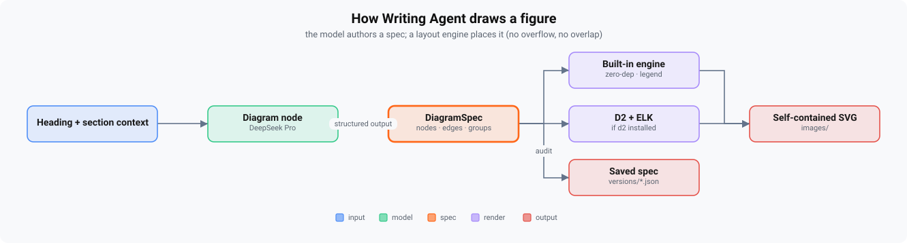

<div align="center">


[](https://pypi.org/project/writing-agent/)
[](https://docs-writingagent.vercel.app/)
[](https://www.python.org/)
[](#install)
[](LICENSE)

### The autonomous long-form writer that argues a thesis and cites real sources - not slop.

**One command → a researched, self-critiqued, fact-checked, exported article (or book).** Local-first and **model-agnostic** (any OpenAI-compatible host), on your own key, for cents.

#### ▶ Try it in your browser - no API key needed
A **[web demo](web/)** runs the whole pipeline behind a simple UI: a **free preview** (placeholder output, $0, no key) shows exactly how a run works, or paste your own key for a real piece. Run the web demo locally with one pip install - `pip install -e ".[web]" && python web/app.py` from a clone - or deploy it as a Hugging Face Space ([guide](web/README.md)).

[Try in browser](web/) · [Quickstart](#quickstart) · [Install](#install) · [Why not just prompt ChatGPT?](#why-not-just-prompt-chatgpt) · [Examples](examples/) · [**Docs ↗**](https://docs-writingagent.vercel.app/)

</div>

---

## What it does

Most AI writing is **fluent slop** - confident, generic, samey, often unsourced. Writing Agent's bet
is the opposite: from one topic it produces a **long-form piece that takes a defensible position and
backs it with real, ranked sources** - then proves it with an **evidence report**. It's a
**pipeline, not a prompt**: a durable state machine with a *separate critic*, a *thesis* it enforces,
and *claim↔source verification* - not a single API call.

**Best at articles** (a finished, sourced piece for **~$0.10–0.25 per article depending on model and
cost mode**, in a couple of minutes); it does **books** too (multi-chapter, with continuity audits + a
production layer).

- **One command** - `write` asks a few questions upfront, then researches, writes, self-critiques, fact-checks, humanises, and exports the finished file with zero babysitting
- **Argues, doesn't just cover** - a per-piece *thesis* the critic enforces, a side-by-side *judge* that picks the strongest of N drafts, and **claim↔source verification** that blocks unsupported citations
- **Writes in any field, even on a cheap model** - a **craft engine** parameterized by *register* (nonfiction, fiction, academic, journalism, copywriting, poetry, screenplay, and more) plus selectable **personas** and **emotions**, so it adapts its rules, voice, and structure to the field instead of forcing one "researcher voice" everywhere (see [Write in any field](#write-in-any-field---registers-personas--the-craft-engine))
- **Proof, not vibes** - every article ships an [**evidence report**](#evidence-report-proof-not-vibes): the argument it makes + every source ranked by influence (0–100)
- **Figures that lay themselves out** - the model authors a diagram *spec*; a layout engine places it so labels never overflow
- **Use it your way** - interactive TUI, one-shot CLI, a **local web dashboard** (`writing-agent web` - run pieces from the browser with live logs, per-agent cost, traces, and evals), or an embeddable Python API
- **Self-correcting *and* (optionally) self-directing** - the default pipeline self-corrects via fixed quality gates; flip on **agentic mode** and an LLM *controller* takes the wheel, choosing the next move both per unit (gather research / read canon before drafting) and over the whole piece (draft, reoutline, revise, consolidate, repair, produce, learn, escalate, done) - and the writer can call tools *mid-draft*. Off by default, with the fixed pipeline as a byte-identical fallback (see [Self-directing mode](#self-directing-mode-opt-in))
- **Model-agnostic - your model, your choice** - no blessed default: run on any OpenAI-compatible host (OpenAI, Anthropic, DeepSeek, Gemini, Groq, Perplexity, OpenRouter, AWS Bedrock/Azure via gateway, local Ollama/LM Studio, …), picked in the first-run wizard or `/provider`, with per-node models swappable via `/model`; everything is plain markdown + JSON on disk; kill a run and it resumes exactly where it stopped; a global `fallback` model keeps an unattended run alive if a tier has an outage
- **Promotes, not just writes** - after the piece is done, `seo` audits it against on-page fundamentals (keyword placement, description, headings, readability) and names its keywords + hashtags, and `promote` repurposes it into an X thread, LinkedIn post, newsletter teaser, TL;DR, and 5 A/B headlines - the HTML export ships SEO/OG/Twitter meta tags (see [Promote it](#promote-it---seo-x-threads-linkedin))
- **Cheap when you want it** - the recommended opt-in `/set cost_mode budget` pins the spend-heavy knobs and routes the judgment nodes to the flash tier, auto-scaling the token budget to the piece's size so a full article still finishes (the default `cost_mode` is `standard`)

> 📂 See real output in [**`examples/`**](examples/) · 📚 full manual at [docs-writingagent.vercel.app](https://docs-writingagent.vercel.app/).

## Why not just prompt ChatGPT?

For a quick paragraph, do. For something you'd **put your name on**, the gap is the point:

| | Prompting ChatGPT/Claude | Writing Agent |
|---|---|---|
| **Effort** | prompt → paste → reprompt → edit → format | one command → finished, exported file |
| **Point of view** | whatever the model defaults to | a contestable **thesis** the critic enforces every section |
| **Sources** | often missing or fabricated | researched, and **each cited claim verified against its source** |
| **Slop** | up to you to catch | a surgical **humanizer** + a critic that blocks AI tells |
| **Range** | one default voice for everything | a **register** per field (fiction → academic → copy), selectable **personas** & **emotions**, working even on a cheap model |
| **Proof** | none | an **evidence report** (thesis + influence-ranked sources) |
| **Your data / cost** | in someone's cloud | local markdown on disk; your key; cents per piece; resumable |

It won't replace a conversation when you want to *steer every sentence*. It replaces the *grind* of
turning a topic into a sourced, non-generic, finished long-form piece.

---

## Quickstart

```bash
pip install writing-agent            # Python 3.10+ · gives you the `writing-agent` command
# or, isolated:  pipx install writing-agent
```

Point it at **any** model host - there's no blessed default, you choose. OpenAI, Anthropic,
DeepSeek, Google Gemini, xAI, Groq, Mistral, Perplexity, Cerebras, SambaNova, aggregators
(OpenRouter, Together, Fireworks), AWS Bedrock / Azure via a gateway, or a local Ollama / LM
Studio - anything OpenAI-compatible (see [`providers.py`](src/writingagent/providers.py) or run
`/provider`). The first-run wizard lets you pick one. Set that host's key and give it a topic - 
OpenRouter is the widest-reach starting point (one key fronts every vendor + reports real USD cost):

```bash
export OPENROUTER_API_KEY=sk-or-...   # or your host's key: OPENAI_API_KEY, ANTHROPIC_API_KEY, ...
# export WRITINGAGENT_PROVIDER=openai # pick a host (or use the first-run wizard / `/provider`)
writing-agent write --abstract "How stoicism applies to modern burnout"
```

`write` asks a few questions upfront (audience, depth, tone, must-includes), then runs fully
autonomously and hands you an exported file. Prefer to drive each step? `writing-agent new → run →
export` - every command is in the [**command reference ↗**](https://docs-writingagent.vercel.app/reference/commands/).

**Try it with no API key.** *Fake mode* returns deterministic placeholder output, so you can
exercise the whole pipeline and exports for free:

```bash
export WRITINGAGENT_FAKE=1                            # applies to both commands below
writing-agent new --abstract "test" --pick 1 && writing-agent run
```

<sub>Windows PowerShell: <code>$env:WRITINGAGENT_FAKE=1; writing-agent new --abstract "test" --pick 1; writing-agent run</code></sub>

---

## Install

**Requirements:** Python 3.10+ with pip · Linux / macOS / Windows · a model-host API key for real
runs (any OpenAI-compatible host - OpenRouter, OpenAI, Anthropic, …; none needed for fake mode).

```bash
# pip (recommended) - installs the `writing-agent` command
pip install writing-agent
# ...or isolated, so its deps stay out of your global env:
pipx install writing-agent

# ...or from source, for development:
git clone https://github.com/vikast908/WritingAgent && cd WritingAgent
pip install -e ".[dev]"              # editable install + test/lint tooling
```

Optional extras install alongside: `pip install "writing-agent[deep]"` (the higher-fidelity
`scrapo-ai` fetch engine + its Playwright browser tier - **Python 3.11+ only**; on 3.10 the extra
installs nothing and the stdlib fetcher is used) and
`pip install "writing-agent[web]"` (the Gradio web demo's dependency). Each optional feature (deep
research, DOCX export, D2 diagrams, embeddings) degrades gracefully when its extra
isn't installed - see the [**installation guide ↗**](https://docs-writingagent.vercel.app/installation/).

**Prefer a browser?** A **web demo** (`web/app.py`, in the repo) runs the whole pipeline behind a
Gradio UI - try it free in fake mode with no key, or paste your own key for a real run. From a clone:
`pip install -e ".[web]" && python web/app.py`, or deploy it as a Hugging Face Space (see
[`web/README.md`](web/README.md)).

---

## How it makes good writing (not slop)

Every chapter/section runs a **write → critique → revise → humanise → commit** loop that optimizes
for a *take*, not just the absence of tells:

- a contestable **thesis** the critic enforces, and a **side-by-side judge** that picks the strongest of N divergent drafts
- **claim↔source verification** - a cited claim the source doesn't support is blocking
- **clean prose, sourced at the end** - inline `[N]` markers are stripped from the body and every source rolls up into one **References list ranked by how much it actually shaped the piece** (cite count + title relevance, scored 0–100, dated), and **scored for credibility** - a deterministic source-authority check demotes SEO/template padding and promotes gov/standards/primary sources, so citation *quality* counts, not just quantity
- a **surgical humanizer** that rewrites only the sentences with AI tells (citations and numbers preserved)
- it **learns which craft moves actually work** - after each piece it distills reusable "skills", and with `skill_duels` on it *A/B-tests* them (drafts one version with a skill held out, lets the critic compare) so trust is earned by cause-and-effect, not guesswork. This is accumulating memory, not model retraining.
- figures that **lay themselves out** - the model authors a spec; a deterministic engine places it (no overflow, no overlap):

<div align="center">



<sub><i>↑ this figure was drawn by the system itself - the same engine that figures your books and articles</i></sub>

</div>

Already generated a piece? **`writing-agent polish --book-id <id>`** re-runs the references, citation, and figure
cleanup and re-exports - with **no model call** (≈0 tokens).

Deep dives: [Quality machinery ↗](https://docs-writingagent.vercel.app/reference/quality/) ·
[How it works ↗](https://docs-writingagent.vercel.app/concepts/how-it-works/) ·
[Architecture ↗](https://docs-writingagent.vercel.app/concepts/architecture/)

---

## Write in any field - registers, personas & the craft engine

The same machinery that fights slop also makes the agent a **good writer in many fields, even on a
basic, cheap model**. The bet: most craft used to live *inside the model*, reached by zero-shot
instructions a weak model can't reliably obey. The **craft engine** moves it to **demonstrations the
model imitates and deterministic checks it can't escape** - the part that doesn't depend on how clever
the model is - and **parameterizes all of it by *register***.

**Registers - the craft contract as data.** A register decides *which* anti-slop bans apply (some
**invert** by field: literary fiction keeps the em-dash, academic keeps "moreover" and *requires*
hedging, copywriting keeps the exclamation and the rule of three), the voice and concreteness lines,
rhythm and diction guidance, the citation style, the target reading grade, and which deterministic
craft metrics matter. **Eleven ship:**

> `nonfiction` (default) · `technical` · `literary-fiction` · `genre-fiction` · `academic` ·
> `journalism` · `copywriting` · `business` · `poetry` · `screenplay` · `children`

The register is **inferred from your genre/angle** unless you pin it with `register`. Leave it alone
and nothing changes: `register=nonfiction` reproduces the historical anti-slop behavior byte-for-byte.

**Why it works on a cheap model - demonstrations + deterministic checks:**

- **Few-shot, not just rules** - before/after pairs for the humanizer and 5-vs-2 *score anchors* for
  the critic. Weak models imitate; they don't follow abstractions.
- **A shipped gold corpus** - genre-tagged "match this" exemplars injected by default through the voice
  slot. A weak model imitating a strong paragraph beats one told to "write vivid prose."
- **Genre-aware craft metrics** - sentence-rhythm variance, passive-voice ratio, adverb density,
  Flesch–Kincaid grade, clichés, and weak openings/closings; fiction registers swap in filter-verb
  density, dialogue ratio, said-bookisms, POV/tense consistency, and sensory density. Computed as
  evidence and handed to the critic - model-independent.
- **Surgical craft passes** - the humanizer's *detect → rewrite-only-the-flaw → guard → splice* pattern
  (citations and numbers preserved, the defect required to strictly reduce) generalized to
  **show-don't-tell** and **passive → active**. Approved prose is never regenerated end-to-end, so a
  cheap micro-edit can't drift your facts. Plus a cross-chapter **voice-drift** report (function-word
  stylometry) folded into the book cohesion audit.

**Field templates & citation styles.** Field templates inject a *structural grammar* into the outline
architect - inverted-pyramid, IMRaD, AIDA/PAS, BLUF, how-to, three-act, screenplay - chosen by the
register or pinned with `field`. References render in your chosen convention via `citation_style`:
`influence` (default · ranked, the existing output) · `numeric` · `apa` · `mla` · `chicago` · `ap` · `none`.

**Personas - a *manner* layer.** A persona flavors diction, rhythm, and stance *within* the register's
rules (it can't break them). Each ships a signature card, an **original-pastiche** exemplar, and the
registers it's compatible with; a persona that doesn't fit the chosen register is **dropped and
logged** (a Nietzschean API reference is not a thing). **Forty-six ship**, covering every register - 
eighteen archetypes (`wry-skeptic`, `warm-mentor`, `hard-boiled-minimalist`, `lyrical-maximalist`,
`deadpan-technical`, `firebrand-essayist`, `confessional-essayist`, `lucid-explainer`, `cultural-critic`,
`contrarian-optimist`, `newsletter-confidant`, `scholarly-lucid`, `punchy-copywriter`,
`bedtime-storyteller`, `investigative-longform`, `plainspoken-pragmatist`, `epic-fantasy`,
`snappy-screenwriter`) and twenty-eight public-domain *manners* (`shakespearean`, `nietzschean`,
`austen-ironic`, `twain-vernacular`, `wildean`, `poe-gothic`, `dickensian`, `whitmanesque`,
`chekhovian`, `kafkaesque`, `montaigne-essayist`, `swiftian`, `dostoevskian`, `tolstoyan`, `melvillean`,
`jamesian`, `conradian`, `gogolian`, `bronte-romantic`, `dickinsonian`, `byronic`, `miltonic`, `homeric`,
`emersonian`, `thoreauvian`, `gibbonian`, `aesopian`, `carrollian`). **No living or in-copyright
authors** - the modern-essay voices (confessional, explainer, cultural-critic, newsletter…) ship as
original *archetypes*, not named Substack/Medium writers, so there's zero copyright surface; for a
specific modern voice, train your own with `voice/` + `/praise`.

**Emotions - anti-cliché, not a glossary.** A symptom dictionary ("fear = racing heart, sweaty palms")
is a *cliché generator*, so the inverse ships: per-emotion **deny-lists** wired into the cliché detector
(so "her heart raced" gets flagged wherever it appears) plus a one-line *show-don't-name* cue. Believable
emotion is carried by the deny-list and the show-don't-tell pass, not a lookup table. Twelve emotions
(the basic-emotion canon - incl. `disgust`, `surprise`, `jealousy`, `pride`), alias-tolerant (`dread`
resolves to fear, `envy` to jealousy, `awe` to surprise).

**One composition model, not five.** Register, field, persona, emotion, and skills are all
voice/constraint layers over a single draft, so they compose in a strict precedence **cascade** - 
outer wins:

```
register  ⊃  field  ⊃  persona  ⊃  emotion  ⊃  skills
(rules+voice) (structure) (manner)  (affect)   (technique, ≤3)
```

The honest constraint behind this: *more layers is worse, not better* - a weak model handed several
voices at once averages them into mush. So the cascade **selects and resolves conflicts; it never
accumulates.** Upper layers are single-select (one register, one field, one persona, one emotion); only
skills stack, and they were already capped and efficacy-gated. The writer gets one "match this" anchor,
resolved by precedence - compatible persona > your own voice > register gold - with the emotion cue
appended.

**New settings** (all tunable with `/set <field> <value>`): `register`, `field`, `citation_style`,
`craft_passes`, `persona`, `emotion`. All clamped to their known sets; leave them empty and the agent
infers sensible defaults and behaves exactly as before.

> Spec: `plan.md` §22 (the craft engine) and §23 (the compositor). Validated across **531 tests**
> (1 skipped), ruff-clean, on Linux · macOS · Windows × Python 3.10–3.13.

---

## Self-directing mode (opt-in)

The default pipeline is **self-correcting**: a fixed order of nodes with quality gates that catch and
fix their own mistakes. Flip on **agentic mode** and it becomes **self-directing** - an LLM *controller*
decides what to do next instead of following a hardcoded phase loop. It's **off by default**
(`agentic=False`), and when off behavior is *exactly* today's pipeline. Nothing changes unless you ask.

The controller works at **two scopes**:

- **Per unit** - before drafting a chapter/section, it can choose to **gather more research** or **read
  the canon** first, then draft (bounded by `agentic_max_unit_steps`, default 3, so every unit
  terminates).
- **Over the whole piece** - a run-level controller picks the next *macro*-action - `draft`,
  `reoutline`, `revise`, `consolidate`, `repair`, `table_read`, `produce`, `learn`, `escalate`, `done` - 
  replacing the fixed `phase` loop entirely.

It can also use **tools mid-draft** (`agentic_inline_tools`): the writer calls `research`, `read_canon`,
or `verify_fact` *while* drafting via a real tool-use loop, double-bounded (per-round **and** total-call
caps) so it can't go on a research spree. Optional **multi-agent panels** add a majority-vote
fact-checker (`agentic_factcheck_panel`) and a diverse-lens critique panel (`agentic_critique_panel`).

Three policies, set with `agentic_policy`:

- **`default`** - identical to the fixed pipeline. This is the **safety floor**: agentic + `default`
  produces *byte-identical* output to a non-agentic run (same text, same episode count, same duel
  count). Only `llm`/`trace` engage the self-directing run controller.
- **`llm`** - a ReAct-style controller call chooses each action.
- **`trace`** - a *learned* policy distilled from the accumulated decision trace (`train_policy`). It's
  opt-in, never auto-promoted, and needs real run volume before it has enough data to bite - on thin
  data it correctly defers to the heuristic.

Every controller decision is appended to an `agent_trace.jsonl` per project, which you can inspect.

Two invariants make turning this on safe: the **WRITE→CRITIQUE episode stays atomic** (the controller
decides *when* to draft, never *how* to bypass the critic, so the self-improving skill-learning loop is
untouched), and the **efficacy gate still owns promotion** (controller choices are candidate signal
only). Everything stays bounded by the action caps, the token budget, and live budget self-monitoring.

```bash
/agentic on        # turn it on (uses the llm policy) and flip the active project live
/agentic llm       # explicitly pick the llm controller
/agentic default   # behave exactly like the fixed pipeline (the equivalence floor)
/agentic off       # back to the fixed pipeline
/trace             # print the active project's agent_trace.jsonl (the controller's decisions)
```

From the Python API: `Agent(agentic=True, agentic_policy="llm")` opts in; flip an existing project with
`orchestrator.apply_controller`. Tunables (settable with `/set <field> <value>`): `agentic`,
`agentic_policy`, `agentic_inline_tools`, `agentic_critique_panel`, `agentic_factcheck_panel`,
`agentic_controller_model`, `agentic_max_unit_steps`.

> **Live-validated (2026-06-16):** a real OpenRouter run produced a finished ~1,547-word article for
> ~$0.15, with the writer calling tools mid-draft. It's an advanced mode and one validated run - the
> fixed pipeline remains the recommended default for most work.

---

## Evidence report: proof, not vibes

Every article ships an **`evidence_report.md`** - the receipts behind "argues a thesis, cites real
sources." It's generated deterministically from the finished piece (no model call), so it's cheap and
trustworthy:

```markdown
# Evidence report - Your Voice Assistant's 100ms Problem

## The argument it makes
> Real-time voice AI at sub-100ms is impossible without streaming partial responses and
> decoupling LLM inference from audio generation, rendering sequential pipelines obsolete.

## At a glance
- **46** sources behind the piece
- **13** high-influence (score ≥ 50)
- **31/46** from high-authority domains (gov · standards · primary research · established outlets)
- **71/100** average source authority
- **27/46** carry a date

## Sources, ranked by influence (0–100)
1. **100** · 2026 · [LLM Inference Optimization: Quantization to Speculative Decoding](…)
2. **86**  · 2026 · [LLM Inference Optimization: KV Cache, and Serving at Scale](…)
…
```

Regenerate any time with **`writing-agent evidence --book-id <id>`** (or `Project.evidence_report()`).

---

## Promote it - SEO, X threads, LinkedIn

A finished manuscript is where *your* job continues: getting it read. Two commands cover that last
step - deterministic where possible, one cheap flash call where a model is needed. **`write` runs
both automatically when a piece finishes** (`auto_promote: true`; set it `false` to opt out).
Everything is **local artifacts only**: a report, `keywords.json`, and draft files under `promo/` - 
the manuscript itself is never modified, and nothing is ever posted or submitted anywhere.

```bash
writing-agent seo --book-id <id> --keyword "voice ai latency"       # audit + signals pack → seo_report.md
writing-agent promote --book-id <id>                                # X thread · LinkedIn · teaser · TL;DR → promo/
writing-agent promote --book-id <id> --to x-thread,linkedin         # just the formats you want
```

- **`seo`** writes `seo_report.md`: a **0–100 on-page audit** (keyword in title/opening/headings,
  description length, heading hierarchy, word-count floor, reading grade, links, image alts - each
  miss with a fix line) plus the **signals pack** (primary/secondary keywords, meta description,
  per-platform hashtags), saved to `keywords.json`. The craft "feel" metrics are appended, so SEO,
  grammar-adjacent readability, and feel live in one artifact.
- **`promote`** writes `promo/`: an **X thread** (hook-first, ≤270 chars/tweet), a **LinkedIn post**
  (fold-surviving opener), a **newsletter teaser** (subject + 150 words), a **TL;DR** (5 bullets),
  and **5 headline variants** (curiosity · how-to · contrarian · data-led · direct) for A/B posting - 
  all reusing the same keyword pack, all forbidden from inventing facts not in the piece.
- The **HTML export** carries `<meta name="description">`, keywords, **Open Graph** and **Twitter
  card** tags from the pack automatically.

Search grounding runs on **DuckDuckGo** (free, keyless, default) or **Firecrawl**
(`search_provider: firecrawl` + `FIRECRAWL_API_KEY` - also upgrades deep-research page scraping);
a missing key degrades gracefully to the free path.

**Cost:** the recommended opt-in `cost_mode: budget` (in `config/settings.yaml`; `/set cost_mode
budget`) pins the spend-heavy knobs - single draft, one revision, 12k context, judgment nodes on the
flash tier - and **auto-scales** the run's token budget to the piece's size (`budget_for_units` ≈ 25k
fixed overhead + ~20k per unit) so a full piece finishes instead of pausing mid-way. Setting an
explicit `max_run_tokens` (> 0) is a hard ceiling that always wins and pauses the run resumably at the
cap. The shipped default is `cost_mode: standard`; every pin is an ordinary tunable.

---

## The web dashboard

```bash
writing-agent web            # opens http://127.0.0.1:8787 - local only, no account, no cloud
```

Everything the TUI does, in a browser - plus the observability the terminal can't show:

- **Studio** - topic → three proposed angles → pick one → a fully autonomous run, streamed live
  (log, phase, progress, pause button; a page refresh reattaches to the running job)
- **Agent activity** - the agent's internal working per run: every controller decision
  (gather research / draft / reoutline / revise) with its reason, every unit's outcome
  (first-pass or revised, insight score), joined with that unit's cost
- **Telemetry** - cost, tokens, cache hits, and latency **per agent, per unit (loop), per model,
  and per session run**, down to individual calls - every LLM call the engine ever made is on disk
  as JSONL and rendered here
- **Evals** - per-unit critic scores, per-attempt verdicts, and the judged 5-dimension eval report
- **Artifacts** - manuscript, thesis, evidence/SEO reports, and the promo drafts, rendered in place
- **Skills · Settings · Models · Themes** - the same learned-skill library, every tunable, per-agent
  model routing, and all 11 TUI themes

It reads and writes the same on-disk brain as the TUI, so the two surfaces never disagree. Pure
stdlib - no extra dependencies. **Local-only by design**: it binds 127.0.0.1 and has no auth, so
don't expose the port.

---

## Architecture

A **multi-agent pipeline on a durable state machine**, in layers from the surface down to the
models. Your interface (TUI · CLI · Python API) drives the **orchestrator**, which runs each unit
through the **agents** - Writer → Critic → Judge → Humanizer - persists to the **markdown brain**
(canon · skills · versions), and feeds the **Learner** so the next piece is better. It's
model-agnostic: every agent routes to its own model tier on whatever OpenAI-compatible host you pick.

<div align="center">


<sub><i>↑ the layered pipeline, kept compact so it stays legible - see [Architecture ↗](https://docs-writingagent.vercel.app/concepts/architecture/) for the full picture</i></sub>

</div>

---

## Documentation

Everything beyond this tour lives at **[docs-writingagent.vercel.app](https://docs-writingagent.vercel.app/)**:

| | |
|---|---|
| [Quickstart ↗](https://docs-writingagent.vercel.app/quickstart/) | from install to a finished article in one command |
| [The TUI ↗](https://docs-writingagent.vercel.app/guides/tui/) | the interactive shell, live dashboard, 11 themes |
| [Commands ↗](https://docs-writingagent.vercel.app/reference/commands/) · [Slash commands ↗](https://docs-writingagent.vercel.app/reference/slash-commands/) | every command and flag |
| [Quality machinery ↗](https://docs-writingagent.vercel.app/reference/quality/) | thesis, judge, claim checks, the learning loop |
| [Model routing ↗](https://docs-writingagent.vercel.app/reference/models/) · [Settings ↗](https://docs-writingagent.vercel.app/reference/settings/) | per-node models; every tunable |
| [Python API ↗](https://docs-writingagent.vercel.app/project/api/) | embed the engine - `Agent` / `Project` |
| [Architecture ↗](https://docs-writingagent.vercel.app/concepts/architecture/) | the markdown memory substrate + state machine |

---

## Contributing

```bash
git clone https://github.com/vikast908/WritingAgent && cd WritingAgent
pip install -e ".[dev]"
ruff check .        # lint
pytest              # the suite runs fully offline (no API key)
```

Issues and PRs welcome - see **[CONTRIBUTING.md](CONTRIBUTING.md)**. The engine spec is in
[`docs/plan.md`](docs/plan.md) and the UI/design system (the editorial ink-on-paper identity shared by the web
dashboard and TUI) in [`docs/design.md`](docs/design.md); also [`SECURITY.md`](SECURITY.md) and
[`CHANGELOG.md`](CHANGELOG.md).

## Author

Built and maintained by [**@vikast908**](https://github.com/vikast908). Questions, ideas, or bugs?
[Open an issue](https://github.com/vikast908/WritingAgent/issues) - feedback is welcome.

## License

[MIT](LICENSE).

<div align="center">
  <sub>Model-agnostic · runs on any OpenAI-compatible host · Linux · macOS · Windows</sub>
</div>
