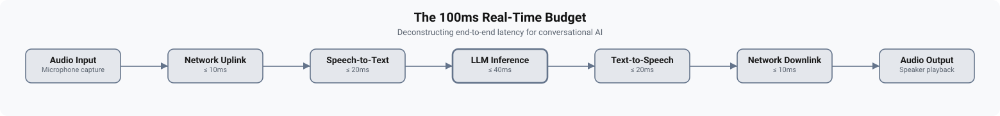
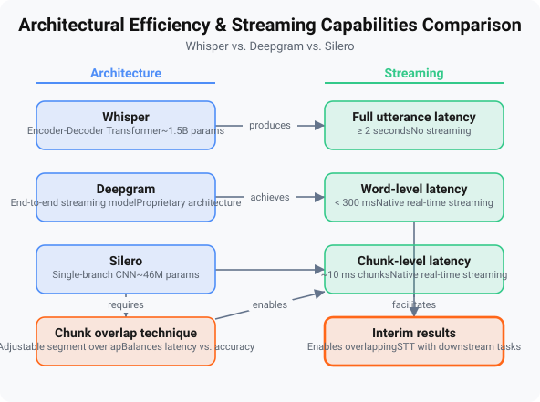
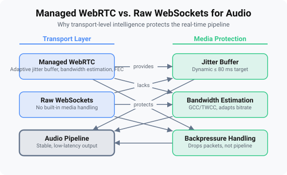

# Your Voice Assistant's 100ms Problem: A Systems-Level Breakdown

*Technical deep-dive into the end-to-end latency budget, treating the 100ms target as a hard real-time constraint. Focuses on the engineering trade-offs and optimization techniques across each subsystem (STT, LLM, TTS, transport).*

**Estimated read time:** 16 min 

---


---

## The 100ms Budget: Deconstructing a Real-Time Constraint

Every millisecond over 100 betrays the user's expectation of real‑time conversation. Voice assistants that pause for 200ms feel sluggish; at 800ms, the thread of dialogue snaps. Jakob Nielsen's response‑time limits teach that 100ms is the threshold for a system to feel instantaneous, 1 second allows uninterrupted thought, and 10 seconds risks losing the user's attention. For conversational AI, these numbers are not just guidelines - they are the difference between a natural dialogue and a frustrating exchange. Human reaction time averages 200 - 250ms, and typical computing overhead adds another 10 - 50ms. To feel faster than a human partner, the system must deliver a complete response under 100ms end‑to‑end.

That 100ms constraint forces a hard real‑time budget. Every stage in the voice pipeline - audio capture, speech‑to‑text (STT), language model inference (LLM), text‑to‑speech (TTS), and network transport - must consume only a fraction of the total, and they must run in parallel or overlapping fashion. A traditional sequential pipeline where STT finishes, then LLM starts, then TTS generates audio would easily exceed 300ms, even with optimized components. Ken Imoto's survey of real‑world stacks shows that systems hovering around 300ms already use streaming, edge AI, and perceptual tricks to mask latency. But reaching sub‑100ms demands a streaming‑by‑default architecture: the speaker's utterance is transcribed in chunks, the language model begins speculating on a reply before the final word is heard, and TTS starts synthesizing speech from the first generated token. Only then can the perceivable delay shrink below the human reflex gap.



Figure 1.1 shows an allocation that a fully‑streaming pipeline must achieve: 25ms for STT to produce its first phoneme‑level hypothesis, 40ms for the LLM to deliver the first token (time‑to‑first‑token, TTFT), 25ms for TTS to convert that token into audible speech, and 10ms for network round‑trip and serialization. These numbers are aggressive; any single bloated component can ruin the budget.

A common objection is that cutting‑edge inference hardware, such as Groq's LPU, can drive LLM TTFT to near zero, obviating the need for overlapping stages. But even with instant token generation, a sequential pipeline still piles up dead time: all audio must be fully captured, the entire utterance processed, and then TTS begins. Under production concurrency, the cumulative overhead of buffer copies, serialization, and transport will reliably push the total beyond 100ms. The only scalable path is to stream partial results at every tier, so that audio playback starts before the LLM has finished thinking. The following sections dissect each stage - STT, LLM, TTS, and transport - and the engineering tactics that keep the entire pipeline inside the 100ms envelope.

---

## The Listener’s Gambit: STT Selection and Streaming Optimization

The 25ms STT slice in the overall budget looks forgiving, but in a sequential pipeline the STT layer blocks everything behind it until a usable transcript appears. That wait - often hundreds of milliseconds for a final result - ruins the end‑to‑end envelope. The article's core claim, that streaming overlap is the only scalable path under 100ms, hinges on the STT subsystem delivering a partial result fast enough that the LLM and TTS can begin hidden behind it.

### Native Streaming vs. Chunk‑Stitched Batch Engines

An engine that emits interim results while the speaker is still talking allows the downstream stages to start before the utterance ends. Whisper's encoder‑decoder architecture processes full sequences and returns a transcript only after complete audio. To stream it, you must slice the input into 200 - 300ms chunks and stitch partial outputs with overlap buffers, which introduces a processing delay proportional to chunk size plus model inference. Without careful tuning, the first token can add hundreds of milliseconds - easily consuming the entire 100ms budget before the LLM fires.

Silero shares this structural limitation. Its encoder‑decoder design is optimized for accuracy on full utterances, not for incremental emission. While Silero's on‑device inference can be fast for short clips, the lack of a built‑in interim‑result API means any streaming wrapper must implement chunk‑based processing and stitch outputs manually, incurring the same chunk‑latency penalty as Whisper. For production voice agents, the absence of a native streaming protocol pushes Silero into a batch‑oriented corner: usable for offline transcription, but not for real‑time conversational systems where every millisecond counts.

In contrast, Deepgram's Nova‑3 and Flux models are designed for streaming: the service sends `is_final: false` interim transcripts as soon as confidence passes an internal threshold. Public documentation reports first‑word latency near 150ms for Deepgram's streaming system. That early result is the signal the pipeline needs. Even a 150ms STT latency, when overlapped with the LLM's TTFT, can keep the perceived response below 100ms because the LLM and TTS are already producing output while the speaker continues.

### Streaming Tactics: Chunk Processing with Interim Forwarding

A typical production setup sends 100ms audio slices to a WebSocket‑based STT service, receiving partial transcripts asynchronously. Using Deepgram's Python SDK with explicit result handling:

```python
import asyncio
from deepgram import Deepgram, LiveTranscriptionOptions

async def stream_stt(audio_chunks, api_key: str, llm_queue: asyncio.Queue):
 dg = Deepgram(api_key)
 options = LiveTranscriptionOptions(interim_results=True,
 utterance_end_ms=500,
 )
 connection = dg.transcription.live(options)

 # Register callback for interim and final transcripts
 def on_transcript(result):
 text = result.channel.alternatives.transcript
 is_final = result.is_final
 # Push (text, is_final, transcript_id) into LLM queue
 asyncio.create_task(llm_queue.put((text, is_final, result.metadata.transcript_id))
 )

 connection.on("transcript", on_transcript)
 await connection.start()

 for chunk in audio_chunks:
 await connection.send(chunk)
 await asyncio.sleep(0) # yield control to event loop
```

The `utterance_end_ms` tuning point balances finalization speed against truncated phrases. A 500ms silence gap is a common compromise: short enough to avoid excessive lag, long enough to avoid fragmented output.

When the callback receives an interim result, the orchestrator immediately forwards the text to the LLM for speculation - no waiting for finalization. However, this introduces a practical complication: the STT can revise earlier interim text as confidence grows, issuing a corrected partial. A naive forward‑and‑forget design will feed stale tokens to the LLM. Orchestrators track a `transcript_id` and either cancel a pending speculative generation when the prefix changes, or feed the revised text and let the LLM's token streaming adapt. A simple cancellation pattern:

```python
pending_id = None
async def handle_transcript(text, is_final, trans_id, llm):
 global pending_id
 if pending_id and trans_id!= pending_id:
 await llm.cancel(pending_id) # abort stale speculation
 pending_id = trans_id
 await llm.start_speculation(text, is_final)
```

This keeps the LLM working on the latest prefix, avoiding wasted compute and garbled output.

### Accuracy‑Latency Trade‑Offs

Interim results are inherently less accurate than final transcripts because they lack right‑side acoustic context. The practical answer matters more than a precise WER delta: for conversational agents, LLMs are remarkably resilient to fragmentary input, and the listen‑as‑you‑speak experience is worth a slightly higher correction rate. When factual precision is paramount - medical dictation, legal transcription - a higher confidence threshold can delay the first interim but reduces downstream rewrites.




*Figure 2.1: The overlapping pipeline. STT emits interim results early, allowing LLM and TTS to start before the utterance ends. Total perceived latency is dominated by the first interim, not the final transcript.*

The gambit is clear: choose a natively streaming STT engine, wire its interim output directly into the LLM, and handle revisions carefully. With that, the STT stage no longer holds up the pipeline; it gives the rest of the system permission to run while the user is still forming the request. The next section tackles the remaining challenge - making the LLM's TTFT small enough that it can slot behind that streaming window.

---

## The Brain at Speed: LLM Inference Under 50ms

Streaming STT hands the LLM a fragment while the user is still speaking. The instant a usable phrase is finalized, the 100 ms end‑to‑end timer starts. Shrinking time‑to‑first‑token (TTFT) below 50 ms is necessary but not sufficient. Even if every token arrived instantly, a sequential pipeline that waits for the full response before handing anything to TTS would pile up dead time from output audio buffering, serialization, and transport jitter. The goal is to push TTFT low enough that TTS can begin on the very first token and let playback mask the generation of everything that follows. Three tactics reclaim those milliseconds: KV‑cache management, speculative decoding, and quantization.

### KV‑cache: trade memory for compute
At each decode step an autoregressive model must attend to every preceding token. Without a key‑value (KV) cache, the attention computation repeats work that grows with the sequence. Storing past keys and values allows each new token to need only a single forward pass that reads from the cache, drastically cutting per‑step latency. The cost is memory: a 7B‑parameter model with a 1k‑token prompt can require several hundred megabytes of cache space, and production frameworks like TensorRT‑LLM and vLLM manage that with paged attention to avoid ballooning decode time.

For the short utterances that voice assistants handle, the prefill phase - processing the prompt in a single batched forward pass - completes in a few milliseconds. The TTFT, however, includes the first decode step that produces token one. That single forward pass still consumes the bulk of the TTFT budget. The KV‑cache's real value comes later, after the first token is emitted. By making subsequent decode steps cheaper, it allows the LLM to produce the full sentence while the TTS is already speaking; the listener never experiences the remaining generation latency.

### Speculative decoding: generate several tokens, verify in one shot
LLM decode is memory‑bound, so a small, fast draft model can propose a batch of candidate tokens. The target model then verifies all of them in a single forward pass and keeps only those that match its own greedy selection. This skips multiple sequential steps and can double or even triple effective token throughput. Voice‑assistant workloads rarely batch more than a handful of requests, so the latency gain is realized without the throughput trade‑off that appears at scale.

The pattern is straightforward when using models with a shared tokenizer vocabulary. The example below pairs a 3‑billion‑parameter draft model with an 8‑billion‑parameter target:

```python
from transformers import AutoModelForCausalLM, AutoTokenizer

assistant = AutoModelForCausalLM.from_pretrained("meta-llama/Llama-3.2-3B-Instruct"
)
target = AutoModelForCausalLM.from_pretrained("meta-llama/Llama-3.1-8B-Instruct"
)
tokenizer = AutoTokenizer.from_pretrained("meta-llama/Llama-3.1-8B-Instruct"
)

inputs = tokenizer("User's streaming phrase", return_tensors="pt").to("cuda")
outputs = target.generate(**inputs,
 assistant_model=assistant,
 max_new_tokens=40,
 do_sample=False,
)
```

The assistant model speculates tokens; the target verifies them in one pass, accepting only the sequence that aligns with its logic. This directly shrinks the wall‑clock time to reach the first token and the early tokens that follow, pushing the system closer to the 50 ms window.

### Quantization: smaller numbers, faster movement
Reducing weight precision from FP16 to INT8 or 4‑bit cuts the memory‑bandwidth demand of every forward pass. AWQ (Activation‑aware Weight Quantization) and GPTQ (Generalized Post‑Training Quantization) can halve per‑token decode time for bandwidth‑bound models, helping the first token arrive within budget. The weight memory savings also let a single consumer GPU hold the model entirely in VRAM. Note that the KV‑cache remains in higher precision by default; reducing its footprint requires separate INT8 KV‑cache quantization, an additional optimization that pairs well with weight quantization when memory is tight.

### Overlap turns speed into conversation
With these techniques, the LLM can produce the first token reliably under 50 ms. The architectural breakthrough is that TTS synthesis starts on that very token. Audio playback of the first phoneme begins while the LLM continues decoding the rest of the sentence, masking all subsequent generation latency. Without this overlap, even a perfectly optimized model emitting tokens at sub‑10 ms intervals would force a delay of tens or hundreds of milliseconds to finish a short utterance - failing the 100 ms ceiling.

### The hardware‑only fallacy
Specialized inference hardware such as Groq's Language Processing Unit (LPU) can drive TTFT near zero, tempting the idea of a simple sequential pipeline. But a sequential design still must collect the full LLM response, serialize it, and buffer the first TTS audio chunk. Network jitter and buffering add unpredictable dead time. Even with instant inference, those accumulated overheads can breach the 100 ms budget under real‑world conditions. Streaming overlap is the only architecture that reliably maintains sub‑100 ms latency under load; pure sequential pipelines are too fragile.

With the LLM's thinking stage compressed and its output overlapped, the next bottleneck shifts to the mouth: a TTS engine that can begin speaking from the very first token.

---

## The Fast Mouth: TTS and the Streaming Audio Frontier

Text-to-speech that waits for the full LLM response before synthesis burns 80 - 200 ms for an utterance, alone breaking the 100 ms budget. The fix is streaming synthesis: TTS must emit the first phoneme as soon as the first token arrives, not after the last.

### Two Architectural Poles

Two local engines illustrate the performance range. **Piper** uses a feed-forward VITS-style network that produces a mel-spectrogram and vocodes it in one pass. On CPU it delivers the first audio sample in under 50 ms. The design avoids autoregressive loops, allowing chunks to be pushed immediately without pre‑buffering the full response. Voice quality is functional but not rich, a trade‑off aimed at latency over aesthetics.

**XTTSv2** takes the streaming approach natively. It generates audio token-by-token through an autoregressive decoder; incremental PCM buffers appear while later tokens are still being computed. The engine exposes a `streaming=True` flag, feeding partial audio to a callback or WebSocket as each decoder step finishes. The autoregressive warm‑up is longer than Piper's, but the pipeline hides it by overlapping synthesis with LLM output. The system does not wait for the utterance to finish; it speaks as soon as the first sub‑phoneme is ready.

### SSML for Real‑Time Prosody

Streaming alone prevents monolithic blocking, but pacing and emphasis still need control. **Speech Synthesis Markup Language (SSML)** lets the orchestrator inject `<break time="30ms"/>` and `<prosody rate="1.1">` directly into the text stream. The TTS engine renders these instructions inline, producing natural pauses without extra synthesis steps. Because the LLM output can be wrapped in SSML as tokens arrive, the audio pipeline begins structuring the response before the utterance is complete.

### Client‑Side Audio Chunk Scheduling

Even with server‑side streaming, the client must start playback without glitching. A minimal JavaScript player queues incoming PCM chunks and begins playing once a small low‑water mark is met, keeping the first syllable within the 100 ms window. Listing 4.1 shows a sketch that appends `Float32Array` chunks, checks buffer duration, and starts an `AudioContext` when the buffer reaches, for example, 30 ms of audio - enough to survive one network jitter without delaying the first phoneme beyond the budget.

```javascript
// Listing 4.1 — Streaming audio player with low-water scheduling
class StreamingPlayer {
 constructor(minBufferMs = 30) {
 this.chunks = [];
 this.minBuffer = minBufferMs;
 this.ctx = new AudioContext({ sampleRate: 24000 });
 this.nextPlayTime = this.ctx.currentTime;
 this.playing = false;
 }

 pushChunk(samples) { // Float32Array
 this.chunks.push(samples);
 this.tryPlay();
 }

 tryPlay() {
 const totalMs = this.chunks.reduce((t, c) => t + c.length / 24000 * 1000, 0
 );
 if (!this.playing && totalMs >= this.minBuffer) {
 this.playing = true;
 this.scheduleNext();
 }
 }

 scheduleNext() {
 if (this.chunks.length === 0) { this.playing = false; return; }
 const chunk = this.chunks.shift();
 const buffer = this.ctx.createBuffer(1, chunk.length, 24000);
 buffer.copyToChannel(chunk, 0);
 const source = this.ctx.createBufferSource();
 source.buffer = buffer;
 source.connect(this.ctx.destination);
 source.start(this.nextPlayTime);
 this.nextPlayTime += chunk.length / 24000;
 source.onended = () => this.scheduleNext();
 }
}
```

The `minBufferMs` value is tuned to the pipeline: it bridges the gap between the arrival of the first audio chunk and the moment the speaker fires, guaranteeing the initial sound lands under 100 ms while covering slight jitter.

### Overlapping LLM and TTS

True latency savings come from orchestrating TTS and LLM in parallel:

1. STT emits an interim partial transcript. 
2. LLM begins autoregressive decoding, and the first token appears. 
3. That token, possibly wrapped in SSML, is sent to the TTS engine immediately. 
4. TTS starts streaming the first audio chunk while the LLM continues generating subsequent tokens.

By the time the LLM finishes the full response, speech has already been playing for tens of milliseconds. This overlap, not raw model speed, keeps user‑perceived response below 100 ms.

### Counterargument: What If Inference Is Instant?

A common objection holds that hardware like Groq's LPU makes sequential pipelines feasible. Yet even with zero‑cost LLM inference, a TTS engine still needs time to produce its first audio fragment. If you wait for the LLM to finish before starting synthesis, that fragment's latency directly adds to the user's wait. Stack transport and buffering, and the total exceeds 100 ms. Streaming overlap is the only scalable solution independent of inference hardware.

### Next

TTS streaming solves the generation bottleneck, but the transport must deliver incremental chunks without head‑of‑line blocking. The next section examines why WebRTC, not raw WebSockets, provides the necessary pacing and jitter control.

---

## The Nervous System: WebRTC vs. WebSockets for Real-Time Audio

The transport layer is where the 100 ms budget survives or breaks. Even if the STT‑LLM‑TTS pipeline completes well within its processing budget (approximately 80 ms, as allocated in Section 1), network serialization, jitter, and head‑of‑line blocking can push total latency past the threshold that humans perceive as instant. The choice between raw WebSockets and managed WebRTC is not a convenience decision; it determines whether the system meets its real‑time constraint.

### What Raw WebSockets Cost

WebSockets provide a full‑duplex TCP tunnel with low framing overhead, but they offer no built‑in jitter buffering, bandwidth estimation, or backpressure. Every one of those functions must be added by the application. A production‑ready pipeline over WebSocket typically requires manual sequencing, a client‑side ring buffer to absorb network variance, and custom control messages (`PAUSE`, `RESUME`) to prevent send‑buffer bloat. These mechanisms interact in complex ways, add latency, and are easy to misconfigure. Teams that have scaled WebSocket‑based APIs report that the operational machinery around the protocol often dominates latency debugging.

### WebRTC's Built‑In Protection

WebRTC is a suite of IETF/W3C protocols designed for real‑time media. Three capabilities are especially valuable for voice agents:

* **Jitter buffering:** Implementations such as NetEQ automatically adjust playout depth based on inter‑arrival jitter statistics carried in RTCP reports. No application‑level ring buffer is needed.
* **Bandwidth estimation and congestion control:** The transport‑wide GCC algorithm probes available bandwidth and adjusts sender bitrate before queues overflow, preventing the stall‑then‑burst pattern that destroys latency targets.
* **Backpressure for audio:** Audio RTP streams lack explicit flow control, but the combination of jitter buffering and bandwidth estimation prevents buffer bloat without application‑level signaling. For data channels, SCTP (Stream Control Transmission Protocol) provides native backpressure through receiver‑window flow control.

Listing 5.1 shows a minimal WebRTC audio pipeline with `aiortc`. The audio track uses RTP; jitter and bandwidth adaptation are properties of the `RTCPeerConnection` object, not application code.

```python
from aiortc import RTCPeerConnection, AudioFrame
from aiortc.mediastreams import AudioStreamTrack
import asyncio

CHUNK_MS = 20
SAMPLE_RATE = 48000
SAMPLES_PER_CHUNK = SAMPLE_RATE * CHUNK_MS // 1000 # 960 samples

class SimulatedPCMStream:
 async def read(self):
 await asyncio.sleep(CHUNK_MS / 1000)
 # Return 20 ms of silence as 16‑bit mono PCM
 return b'\x00' * (SAMPLES_PER_CHUNK * 2)

class PCMAudioTrack(AudioStreamTrack):
 def __init__(self, pcm_stream):
 super().__init__()
 self._stream = pcm_stream

 async def recv(self):
 pcm_data = await self._stream.read()
 frame = AudioFrame(format="s16", layout="mono",
 samples=SAMPLES_PER_CHUNK)
 frame.planes.update(pcm_data)
 frame.sample_rate = SAMPLE_RATE
 return frame

async def setup_webrtc_pipeline(pcm_stream):
 pc = RTCPeerConnection()
 track = PCMAudioTrack(pcm_stream)
 pc.addTrack(track)
 offer = await pc.createOffer()
 await pc.setLocalDescription(offer)
 # Exchange offer/answer via signaling server …
 return pc
```

*Listing 5.1: Minimal WebRTC audio track that feeds PCM chunks. Jitter buffering and bandwidth estimation are handled by the peer connection transparently.*

By contrast, a WebSocket approach (Listing 5.2) must manually frame chunks with sequence numbers, reorder on the client, and implement an application‑level high‑water mark to trigger a `PAUSE` signal. Every line of that custom logic is a source of latency and brittleness under network variability.

```python
import asyncio, websockets

class WSClient:
 def __init__(self, uri, high_water=3):
 self.uri = uri; self.high_water = high_water
 self.queue = asyncio.Queue(); self.paused = False
 self.next_seq = 0

 async def recv_loop(self):
 self.ws = await websockets.connect(self.uri)
 async for msg in self.ws:
 seq, chunk = deserialize(msg) # custom framing
 await self.queue.put((seq, chunk))
 if self.queue.qsize() >= self.high_water and not self.paused:
 await self.ws.send("PAUSE")
 self.paused = True

 async def playout(self):
 while True:
 seq, chunk = await self.queue.get()
 if seq == self.next_seq: # strict ordering
 # feed chunk to audio device …
 self.next_seq += 1
 if (self.paused and
 self.queue.qsize() < self.high_water // 2):
 await self.ws.send("RESUME")
 self.paused = False
 # else: hold for reordering (adds jitter)
```

*Listing 5.2: WebSocket client fragment with manual sequencing and backpressure. The playout logic must handle reordering and buffer drains, adding latency and test surface.*

### Transport Overhead, Not Inference, Defines the Budget

Even if a Groq LPU reduced LLM time‑to‑first‑token to near zero, a sequential pipeline would still accumulate serialization, buffering, and jitter delays. WebRTC's protocol‑level handling makes these overheads small and predictable. Without it, the combined transport burden can push end‑to‑end latency beyond what a human perceives as instant. The article's thesis that overlapping stages are necessary remains true, but the transport layer is the last mile where latency budgets are breached: without managed real‑time transport, the pipeline fails the 100 ms constraint regardless of how fast the models are.

### The Industry's Direction

The W3C's 2021 joint meeting of the WebRTC and Media Working Groups noted that WebRTC supplies built‑in jitter buffering and bandwidth estimation, making it the appropriate transport for real‑time audio. Voice‑agent testing guides similarly warn that transport failures, not model speed, are the most common latency misses. For conversational voice applications, prefer managed WebRTC over raw WebSockets. Reserve WebSockets for non‑interactive streams, control metadata, or server‑to‑server channels where a stable path is guaranteed and the 100 ms constraint does not apply.

**Figure 5.1: Transport overhead comparison under real‑world conditions. WebRTC's built‑in jitter buffer and bandwidth estimation eliminate the manual logic required with WebSockets. When the playout buffer exceeds a high‑water mark, the WebSocket client must explicitly signal the server to pause.** 


---

## Deploying Speed: Cold Starts, GPU Resource Management, and Production Gotchas

A pipeline that measures 90 ms in a lab can break the 100 ms barrier in production. The culprits are seldom model architecture or codecs; they are GPU cold starts, model‑swapping delays, and concurrency‑induced tail latency - each capable of injecting seconds before the first token appears.

When a container claims a GPU for the first time, loading model weights from disk into VRAM takes several seconds, and the inference runtime's kernel auto‑tuning adds a further pause on the initial call. An autoscaler that spins up a fresh replica during a traffic spike forces the unlucky user to endure that entire stall. Even after warm‑up, batched serving can inflate tail latency. vLLM's continuous batching, for example, keeps the GPU busy by admitting requests aggressively; under heavy load the 99th‑percentile time‑to‑first‑token can stretch beyond the LLM's budget.

Streaming overlap absorbs small jitter from transport or scheduling, but it cannot compensate for multi‑second stalls. Production deployments must eliminate cold starts at every layer.

Pre‑load all base models into GPU memory during container startup, before accepting traffic. Managed platforms recommend keeping a base model resident and swapping lightweight LoRA adapters per request rather than reloading full fine‑tuned checkpoints. To cap inference tail latency, tune vLLM's scheduler with a conservative `max_num_seqs` and a per‑request timeout.

**Listing 6.1 - Model warm‑up with vLLM.** Run this at service start to force kernel compilation and KV‑cache allocation, so the next real request sees zero cold‑start overhead.

```python
from vllm import LLM, SamplingParams

llm = LLM(model="meta-llama/Meta-Llama-3.1-8B-Instruct",
 tensor_parallel_size=1,
 max_num_seqs=8) # bound concurrency
warmup_prompt = "Hello"
llm.generate([warmup_prompt], SamplingParams(max_tokens=1))
```

**Production readiness checklist**

1. Load all models in the deployment's init phase - never on the first request.
2. Use LoRA or prompt‑tuning for per‑user adaptation; avoid full model swaps.
3. Set the autoscaler's cooldown long enough to retain warm instances through brief usage dips.
4. Monitor inference tail latency (p50, p95, p99) and alert if p99 breaks the component's time‑to‑first‑token budget defined in Section 3.
5. Run end‑to‑end benchmarks under simulated conversational load at multiple concurrency levels; the full pipeline, including transport jitter, must stay below the 100 ms threshold.

Even with perfectly warm infrastructure, concurrent requests can push cumulative tail latency past 100 ms. The streaming overlap techniques described earlier remain the only scalable way to keep the user experience intact while the infrastructure absorbs these unavoidable production shocks.

---

---

## References

*Ranked by influence on this article (0–100; higher = more influence). Dated where known.*

1. **100** · 2026 · [The LLM Inference Optimization: Quantization to Speculative ...](https://www.digitalocean.com/community/tutorials/llm-inference-optimization-quantization-to-speculative-decoding-part-2)
2. **100** · 2026 · [AI Inference Optimization: How Quantization, KV-Cache ...](https://www.linkedin.com/pulse/ai-inference-optimization-how-quantization-kv-cache-speculative-kots-44l2c)
3. **86** · 2026 · [LLM Inference Optimization: Quantization, KV Cache, and Serving at Scale](https://pr-peri.github.io/blogpost/2026/03/25/blogpost-llm-quantization-kv-cache.html)
4. **80** · 2026 · [LLM Inference Optimization and Quantization 2026](https://zylos.ai/research/2026-01-15-llm-inference-optimization/)
5. **80** · 2026 · [KV Caching and Speculative Decoding - The Production Gap](https://boringbot.substack.com/p/kv-caching-and-speculative-decoding)
6. **75** · n.d. · [Voice Agent Architecture: STT, LLM, and TTS Pipelines Explained](https://livekit.com/blog/voice-agent-architecture-stt-llm-tts-pipelines-explained)
7. **71** · n.d. · [The Latency Problem: The One Thing Killing Your Voice AI Experience ...](https://smallest.ai/blog/the-latency-problem-the-one-thing-killing-your-voice-ai-experience-and-how-to-fix-it)
8. **71** · 2026 · [LLM inference optimization: techniques that actually reduce latency](https://www.runpod.io/blog/llm-inference-optimization-techniques-reduce-latency-cost)
9. **67** · 2026 · [LLM Inference Optimization Complete Guide: KV Cache, Speculative Decoding, and More (2026)](https://www.youngju.dev/blog/ai/2026-03-17-llm-inference-optimization-guide.en)
10. **67** · 2025 · [An Introduction to Speculative Decoding for Reducing Latency in AI Inference](https://developer.nvidia.com/blog/an-introduction-to-speculative-decoding-for-reducing-latency-in-ai-inference/)
11. **60** · n.d. · [Voice AI Latency: What's Fast, What's Slow, and How to Fix It](https://hamming.ai/resources/voice-ai-latency-whats-fast-whats-slow-how-to-fix-it)
12. **50** · 2025 · [How Fast is Human Reaction Time? Brain & Perception](https://www.pubnub.com/blog/how-fast-is-realtime-human-perception-and-technology/)
13. **50** · 2026 · [How To Handle Real-Time Audio Streams With Voice API Integration](https://www.frejun.ai/real-time-audio-streaming-voice-api-integration/)
14. **44** · n.d. · [Strategies for Reducing LLM Inference Latency and making Tradeoffs: Lessons from Building](https://medium.com/@sumanta.boral/strategies-for-reducing-llm-inference-latency-and-making-tradeoffs-lessons-from-building-9434a98e91bc)
15. **43** · n.d. · [Voice AI Infrastructure: Building Real-Time Speech Agents](https://introl.com/blog/voice-ai-infrastructure-real-time-speech-agents-asr-tts-guide-2025)
16. **43** · n.d. · [Streaming Speech Recognition API for Real-Time Transcription](https://deepgram.com/learn/streaming-speech-recognition-api)
17. **43** · n.d. · [Build a Low-Latency ChatGPT Voice Assistant in Python](https://picovoice.ai/blog/add-voice-to-chatgpt/)
18. **43** · n.d. · [On-Device LLM Inference Powered by X-Bit Quantization (picoLLM)](https://github.com/picovoice/picollm)
19. **43** · 2026 · [When To Choose Long Polling vs Websockets for Real-Time Feeds](https://getstream.io/blog/long-polling-vs-websockets/)
20. **40** · n.d. · [Chained Voice Agent Architectures: Speech-to-Speech vs Chained](https://brain.co/blog/chained-voice-agent-architectures-speech-to-speech-vs-chained-pipeline-vs-hybrid-approaches)
21. **40** · n.d. · [Measuring STT Latency | Deepgram's Docs](https://developers.deepgram.com/docs/measuring-streaming-latency)
22. **40** · n.d. · [How to Speed up AI Inference with vLLM Continuous Batching](https://voice.ai/hub/tts/vllm-continuous-batching/)
23. **33** · n.d. · [Architecting Scalable Agentic AI architecture Systems with Python, FastAPI, LangChain, and AWS](https://infonews.in/architecting-scalable-agentic-ai-architecture-systems-with-python-fastapi-and-llms/)
24. **33** · 2025 · [The Psychology of Response Time: What Your Reply Speed Says About You](https://www.mosaicchats.com/blog/psychology-response-time-relationships)
25. **33** · 1 month ago · [Compare Fastest TTS APIs 2026: Streaming & Low Latency - Smallest.ai](https://smallest.ai/blog/top-fastest-text-to-speech-apis-in-2026)
26. **29** · n.d. · [The 300ms rule: Why latency makes or breaks voice AI applications](https://www.assemblyai.com/blog/low-latency-voice-ai)
27. **29** · 2026 · [Building Production-Ready Voice Agents – Shekhar Gulati](https://shekhargulati.com/2026/01/03/building-production-ready-voice-agents/)
28. **29** · 2021 · [WebRTC / Media / Audio WG joint meeting – 26 October 2021](https://www.w3.org/2021/10/26-webrtc-minutes.html)
29. **27** · 2025 · [12 Best Open-Source TTS Models Compared (2025): Latency, Quality, Voice Cloning & More](https://www.inferless.com/learn/comparing-different-text-to-speech---tts--models-part-2)
30. **25** · 2023 · [Lessons Learned: WebSocketAPI at scale](https://medium.com/draftkings-engineering/lessons-learned-websocketapi-at-scale-604617a54cdb)
31. **20** · n.d. · [GitHub - ufal/whisper_streaming: Whisper realtime streaming for](https://github.com/ufal/whisper_streaming/)
32. **20** · n.d. · [Speech-to-Text Latency: How to Measure and Minimize](https://picovoice.ai/blog/speech-to-text-latency/)
33. **20** · 2025 · [Human Benchmark - Reaction Time Test](https://humanbenchmark.com/tests/reactiontime)
34. **20** · 3 weeks ago · [Best TTS Models 2026: Elo, Vendors, and Open-Weight Voice AI | CodeSOTA](https://www.codesota.com/guides/tts-models)
35. **20** · 1 month ago · [Local TTS and Voice Cloning 2026: Piper vs Coqui vs XTTS v2 vs F5-TTS vs Bark vs StyleTTS 2](https://www.promptquorum.com/power-local-llm/local-tts-voice-cloning-piper-coqui-xtts)
36. **17** · n.d. · [Adding "Whisper" as local STT option? - Speech To](https://community.openconversational.ai/t/adding-whisper-as-local-stt-option/12601)
37. **17** · n.d. · [Open Source Audio Models: Text-to-Speech and Speech-to-Text](https://blog.premai.io/the-rise-of-open-source-audio-models-text-to-speech-and-speech-to-text/)
38. **14** · n.d. · [Qwen3.5-Omni: Voice Style, Emotion & Volume Control](https://qwen3lm.com/voice-style/)
39. **14** · 2024 · [r/LocalLLaMA on Reddit: 🚀 Analyzed the latency of various TTS models across different input lengths, ranging from 5 to 200 words!](https://www.reddit.com/r/LocalLLaMA/comments/1giqxph/analyzed_the_latency_of_various_tts_models_across/)
40. **14** · 2024 · [WebSocket Voice Agent Testing: A No-Phone-Number Guide](https://hamming.ai/resources/websocket-voice-agent-testing-guide)
41. **14** · 2026 · [Fine-Tuning LLMs for Production: A Practical Guide to QLoRA...](https://medium.com/@shubhodaya.hampiholi/fine-tuning-llms-for-production-a-practical-guide-to-qlora-evaluation-and-deployment-e161a68584c8)
42. **14** · 2026 · [What is xlm roberta? Meaning, Architecture, Examples, Use Cases...](https://aiopsschool.com/blog/xlm-roberta/)
43. **12** · 1 month ago · [Best STT APIs 2026: Deepgram Nova-3, AssemblyAI, Whisper](https://futureagi.com/blog/speech-to-text-apis-in-2026-benchmarks-pricing-developer-s-decision-guide/)
44. **12** · 2026 · [Best STT Providers 2026: Independent Benchmarks & How to Choose | Coval](https://www.coval.ai/blog/best-speech-to-text-providers-in-2026-independent-benchmarks-and-how-to-choose/)
45. **11** · 2013 · [gui design - What, as a rule of thumb, is the maximum tolerable time the UI thread is blocked](https://ux.stackexchange.com/questions/42684/what-as-a-rule-of-thumb-is-the-maximum-tolerable-time-the-ui-thread-is-blocked)
46. **10** · n.d. · [Introducing Strands Agents 1.0: Production-Ready Multi-Agent Orchestration Made Simple](https://aws.amazon.com/blogs/opensource/introducing-strands-agents-1-0-production-ready-multi-agent-orchestration-made-simple/)
